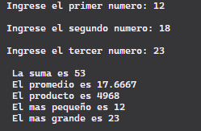

# Ejercicio de laboratorio 1: Suma, Promedio, Máximo y Mínimo

## Descripción

Escriba un programa que lea tres números enteros del teclado e imprima la suma, el promedio, el producto, el más pequeño y el más grande de estos números. El diálogo de la pantalla debería aparecer de la siguiente manera:

```cmd
Ingrese tres enteros diferentes: 13 27 14
La suma is 54
El promedio es 18
El producto es 4914
El más pequeño es 13
El más grande es 27
```

## Contesta las siguientes preguntas

1. Modifique su solución para usar tres declaraciones cin separadas en lugar de una. Escribe un mensaje separado para cada cin.


2. ¿Importa si se usa < o <= al hacer comparaciones para determinar el número entero más pequeño? ¿Cuál usaste y por qué?

No importa ya que sigue validando si el numero es menor, si el numero llegara a ser igual significaria que hay 2 valores iguales y siendo los menores.
En mi caso utilice el "<" y ">" para hacer mejores comparaciones.

3. En el programa, probablemente usó una variable double o float para almacenar el promedio. Cambie el tipo de esa variable a entero. ¿El resultado es diferente de lo que observó anteriormente?

Esto depende de como se escriba la operacion del promedio:
en mi caso utilice la siguiente operacion
float promedio = suma / 3;
Esta operacion nos arrojara un resultado entero a pesar de que el resultado sea decimal y se almacene en una variable de tipo float 
Esto pasa por que el c++ ejecutara la division entera de suma / 3 ya que ambos son enteros.
Revisandolo lo corregi a suma / 3.00, esto nos daria un resultado float que era el esperado. 
Resolviendo la pregunta del incio si afectaria cambiar la variable de tipo float a int si la operacion fuera la siguiente float promedio = suma / 3.00.
Caso contrario no afectaria.

## ✅ Resultado



(Añadir captura de pantalla del resultado de la ejecución)
